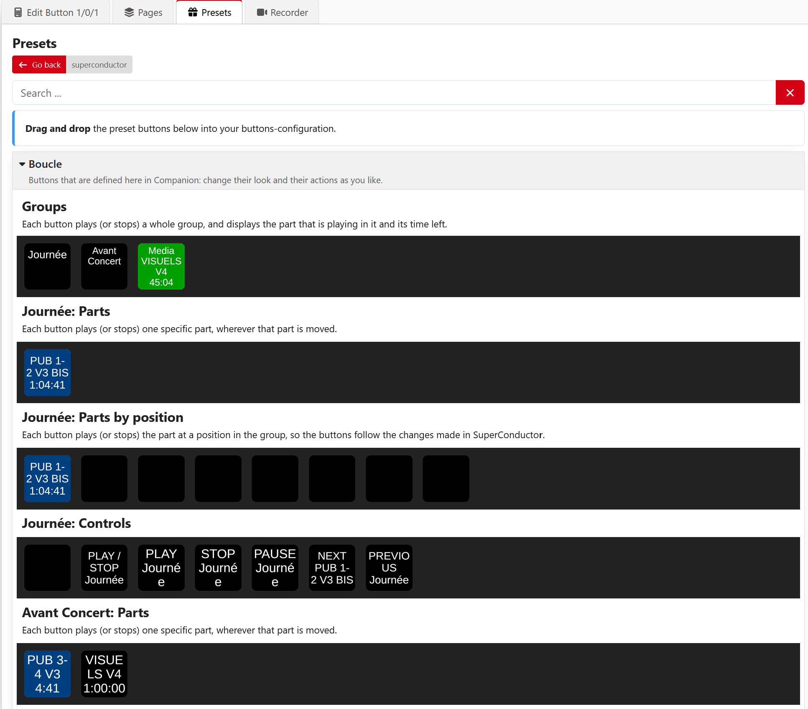
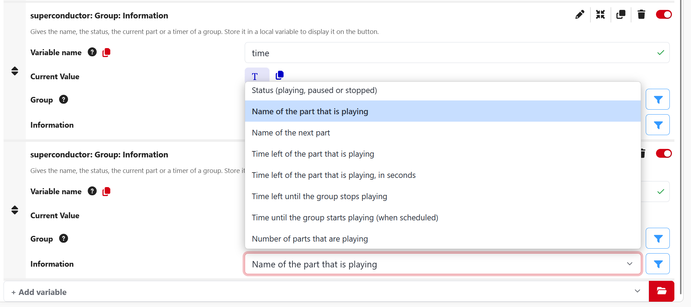

# companion-module-superflytv-superconductor

A [Bitfocus Companion](https://bitfocus.io/companion) module that controls the playout of
[SuperConductor](https://github.com/SuperFlyTV/SuperConductor) and shows names, statuses and timers on the buttons.

See [companion/HELP.md](./companion/HELP.md) for how to use it.

## Screenshots

The presets follow the rundowns of SuperConductor: there are buttons for each group, each part,
each position in a group, and the controls of a group. Drag them onto a button.



The names, statuses and timers are given by the **Information** feedbacks, which store a text
in a local variable of the button.



## Requirements

- Companion 5.0.5 or later (the module uses version 2.1 of the module API).
  Earlier 5.0 versions load the module, but they drop the local variables of the presets, so the buttons display `$NA`.
- A build of SuperConductor that has the **Companion API** (the `feat/companion-control` branch).
  The API is off by default, enable it in SuperConductor on the home page → **Bridges** → **Companion**.

## How it works

The module connects to SuperConductor over a WebSocket (port 5505 by default) and exchanges JSON messages.
The protocol is described in [src/protocol.ts](./src/protocol.ts), which is a copy of
`apps/app/src/lib/companion/protocol.ts` in SuperConductor. Keep the two in sync.

The buttons are defined in Companion: the module provides actions, feedbacks, variables and presets
(per group, per part and per position in a group), and Companion draws the buttons.

SuperConductor sends the playout state as absolute timestamps and only when it changes.
The timers are counted locally by the module, using a clock offset that is measured with pings,
so they stay correct when Companion and SuperConductor run on different computers.

## Development

Node.js 22 and Yarn 4 are required.

```sh
yarn install
yarn build      # compile to dist/
yarn test       # unit tests
yarn lint
yarn package    # build superflytv-superconductor-<version>.tgz, which can be imported in Companion
```

To try a local build, point Companion at the folder that contains this repository
(Companion launcher → cog wheel → Developer modules path), or import the packaged `.tgz`
on the Modules page of Companion.

## License

MIT, see [LICENSE](./LICENSE).
